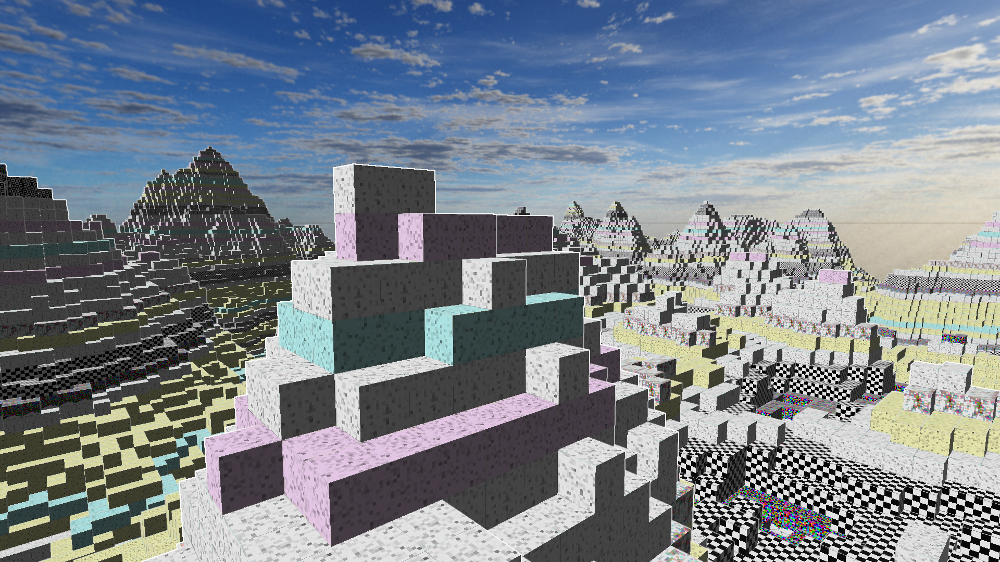
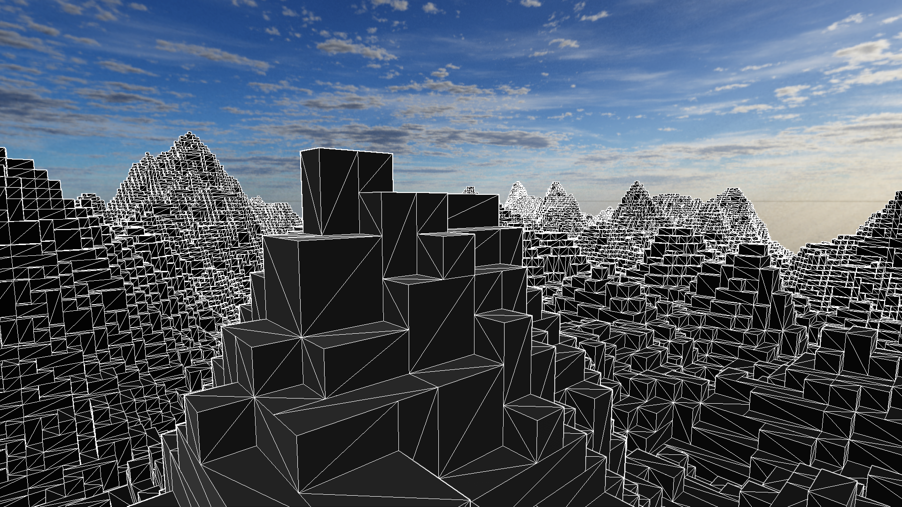
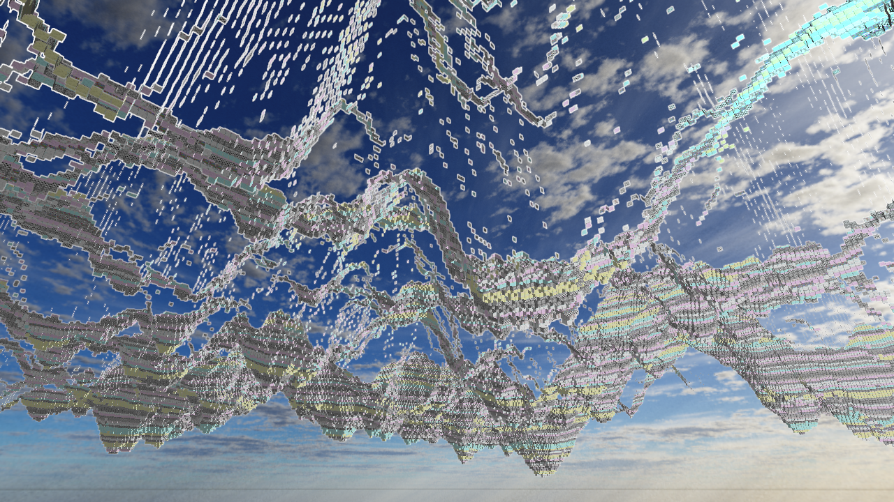

# My First Voxel Engine

# Technical Information
### Features:
- Infinite terrain generation (using basic perlin noise)
- Dynamic chunk remeshing (single-threaded)
- Static skybox (just using a cubemap)
- Greedy Meshing (unoptimized, but still reasonably fast)
- Basic diffuse + specular lighting
- Outline post processing pass using the depth buffer
- Textured blocks with mipmapping

## Wireframe view

## View under the map to verify back face culling

# Further improvements to be made:
- Smaller vertex size (currently 24 bytes per vertex 😞)
- Optimized meshing (using SIMD extensions + bigger chunk size)
- Dynamic skybox with sun as directional light source
- Shadow mapping
- Screen-Space Ambient Occlusion
- Multi-threaded chunk generation and meshing
- Distance Fog
- Frustum Culling
- Add/Removing blocks
- debug outline flickering
- debug mipmap edges

# References
#### Greedy Meshing: https://0fps.net/2012/06/30/meshing-in-a-minecraft-game/
Initial copied the meshing code directly from Javascript and translated to C++; but the algorithm did not provide face normals, thus I had to ultimatly write my own greedy meshing that did give normal data. However, this article did give me a better understanding of the greedy meshing algorithm.

#### Outline Post-Pass: https://omar-shehata.medium.com/how-to-render-outlines-in-webgl-8253c14724f9
Got the method of how to get a basic outline from this article, but I wanted only a basic outline, so the depth buffer was enough.