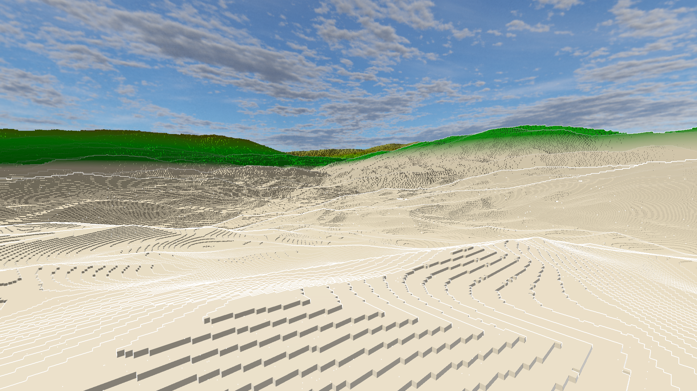
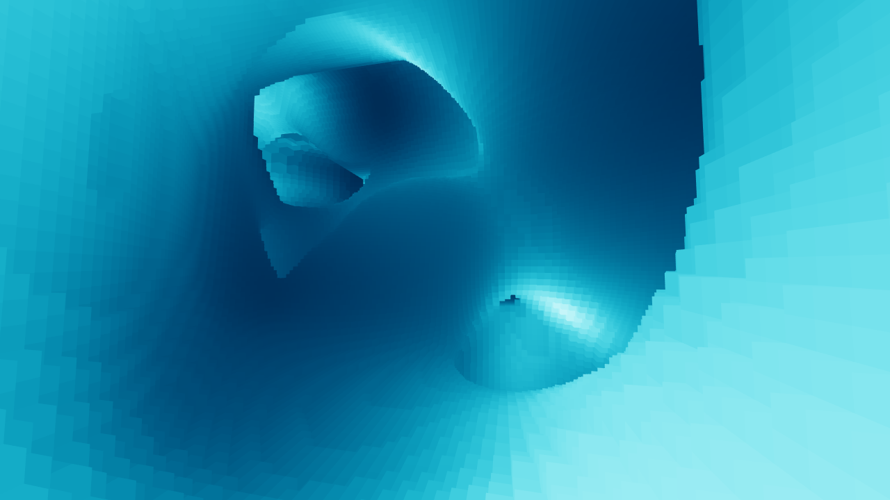

# My First Voxel Engine

# Building
1. Run `setup_windows.bat` (or use command `premake5 vs2022` if you have premake)
2. Open generated Visual Studio Solution to build code

# Technical Information
### Features:
- Infinite terrain generation (using basic perlin noise)
- Dynamic chunk remeshing (multi-threaded)
- Static skybox (just using a cubemap)
- Greedy Meshing (unoptimized, but still reasonably fast)
- Outline post processing sub-pass using the depth buffer
- ~~Diffuse + specular lighting~~
- ~~Textured blocks with mipmapping~~

## Some development pictures

# Further improvements to be made:
- Optimized meshing (using SIMD extensions)
- Dynamic skybox with sun as directional light source
- Shadow mapping
- Screen-Space Ambient Occlusion
- Distance Fog
- Frustum Culling

# References
#### Greedy Meshing: https://0fps.net/2012/06/30/meshing-in-a-minecraft-game/
Initially copied the meshing code directly from Javascript and translated to C++; but the algorithm did not provide face normals, thus I had to ultimatly write my own greedy meshing that did give normal data. However, this article did give me a better understanding of the greedy meshing algorithm.

#### Outline Post-Pass: https://omar-shehata.medium.com/how-to-render-outlines-in-webgl-8253c14724f9
Got the method of how to get a basic outline from this article, but I wanted only a basic outline, so the depth buffer was enough.
